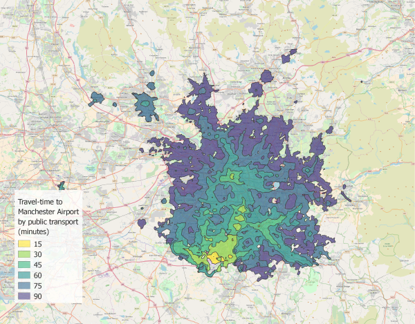

# Advanced Usage of OpenTripPlanner

## Configuration
Try running the OTP .jar file with the `--help` option for a full list of command line parameters. See the [configuration](Configuration) page for configuration settings which effect either the router instance or the graph building process (e.g. fare settings, elevation models, request logging, transfer settings, etc.)

## Using the web API to plan a transit trip
The [basic-usage](Basic-Usage) page showed examples of the web API returning static schedule data for an agency or a route. Much more interesting and advanced interactions are of course possible. For example, you may request an itinerary from one place to another at a particular time:

[`http://localhost:8080/otp/routers/default/plan?fromPlace=43.637,-79.434&toPlace=43.646,-79.388&time=1:02pm&date=11-14-2017&mode=TRANSIT,WALK&maxWalkDistance=500&arriveBy=false`](http://localhost:8080/otp/routers/default/plan?fromPlace=43.637,-79.434&toPlace=43.646,-79.388&time=1:02pm&date=11-14-2017&mode=TRANSIT,WALK&maxWalkDistance=500&arriveBy=false)

The above query makes a request to the locally running server `http://localhost:8080/`, requesting the [planner resource](http://dev.opentripplanner.org/apidoc/1.0.0/resource_PlannerResource.html) `...otp/routers/default/plan`, and passes the following parameters:

- **fromPlace=43.637,-79.434**, the origin of the trip, in latitude, longitude
- **toPlace=43.646,-79.388**, the destination of the trip
- **time1:02pm**, the desired departure time
- **date=11-14-2017**, the desired departure date
- **arriveBy=false**, specifies that the given time is when we plan to depart rather than when we want to arrive
- **mode=TRANSIT,WALK**, transport modes to consider, in this case a combination of walking and transit
- **maxWalkDistance=500**, the maximum distance in meters that you are willing to walk

If you run this query as is you will very likely get a response saying that a trip has not been found. Try changing the fromPlace, toPlace, time and date parameters to match the location and time period of the data you loaded when you initially built the graph. More (optional) parameters for the planner resource are documented [here](http://dev.opentripplanner.org/apidoc/1.0.0/resource_PlannerResource.html). 

## Analysis functionality
OpenTripPlanner can also be used to calculate the area which is accessible within a given travel time, also known as a travel time isochrone. 

_Image courtesy of [marcusyoung](https://github.com/marcusyoung)_

[`http://localhost:8080/otp/routers/default/isochrone?fromPlace=45.51884,-122.67921&date=11-14-2017&time1:02pm&cutoffSec=3600`](http://localhost:8080/otp/routers/default/isochrone?fromPlace=45.51884,-122.67921&date=11-14-2017&time1:02pm&cutoffSec=3600)

See the documentation [here](http://dev.opentripplanner.org/apidoc/1.0.0/index.html#resources) for a full list of available options.
