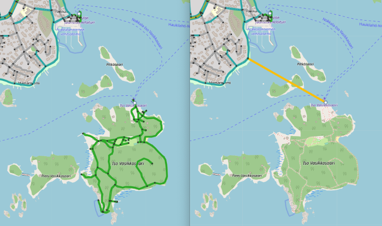
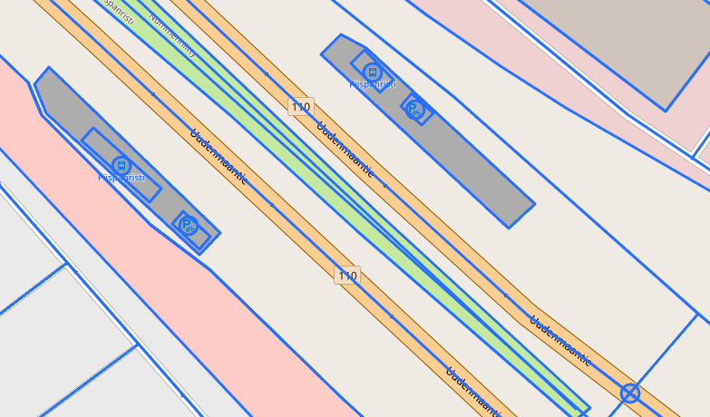
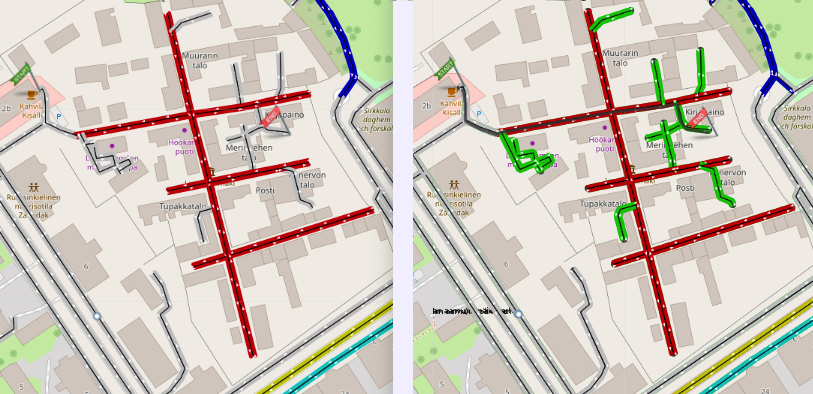
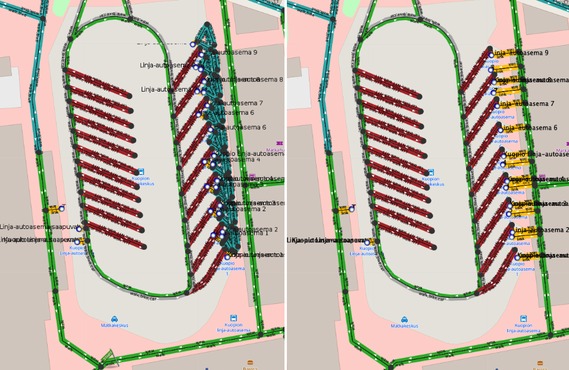

# Street graph pruning

A street graph created from OpenStreetMap data has sections which cannot be reached with some or all traverse modes. For example,
true geographic islands are usually disconnected from the main graph. The street network of such islands should be kept so that routing
within the island or continuing from a ferry stop on it works as expected. Even a tiny street network connected to a ferry stop improves
routing to an island a lot, because coordinate based itinerary searches find something to project onto.

\
*Removing a small subgraph from an island causes poor routing. Ferry stop on the island links directly to mainland.*

Disconnected part can also represent a strictly forbidden area, such as connections within an industrial unit, roads of a military base or another
region which cannot and should not be accessed when using door to door routing of a public transit journey planner. Existence
of such graph sections is harmful, because start and end points of an itinerary search request may accidentally get projected to such a private pathway.
As a result, user does not receive any itineraries and gets no explanation for the routing problem.

In most cases, connectivity problems are caused by incorrect modeling of OSM data. The number of such errors is usually very large,
and the problem cannot be solved  by simply fixing OSM data as soon as errors  get detected. OSM street network in Finland contains
over 10 000 detected walk connectivity issues. An algorithmic solution is needed to address a problem of such magnitude.

\
*Typical error: bus platforms are not connected to street network at all*

A simple and efficient solution is to detect harmful disconnected parts and remove them from the street graph. Routing then uses the properly connected
part of the graph and finds itineraries. As a side effect, the start point of an itinerary search which departs from the removed graph projects at the border of it,
which usually is good enough. Transfers may include strange teleportation and unexpected walking, as public transit stops may link to somewhat remote streets,
but at least transfers will work.

\
*Disconnected railway platform breaks routing. Traveler is guided to take a round trip around the country although there is one hour direct train connection.*

## Access restriction islands

One common reason for OSM connectivity problems is access tagging. It is perfectly OK to tag a front yard of a private residence using access=private or access=destination tags, so that
strangers are not guided to travel through the private area. Routing will still use the private streets if a trip starts or ends there - only pass through traversal gets prohibited.
However, sometimes OSM contributors try to block the traffic by tagging only entrance segments of streets leading to a restricted area. Unfortunately this totally
prevents access to the interior part of the network, because OTP interprets it as pass through traffic. Pruning handles such problems by converting streets behind an access restriction
to have the same access properties.

\
*Some regular (gray colored) streets are blocked behind access restricted (red colored) connections. Walk routing to them fails because it would be considered as pass through traffic.
Image on the right shows that pruning added walk nothrough restricition to those streets, and routing works again.*

## Pruning algorithm

Pruning analyses the three traverse modes - walk, bike and car - separately. For example, a resting area by a motorway may include some walking paths, but the only way to get there is
to use car. Therefore, it represents a disconnected 'island' when considering the walk mode. Pruning does not erase disconnected graph geometry as long as it
can be reached using any of the traverse modes. Instead, pruning removes traversal permission for each disconnected mode from the island.

Pruning uses four parameters and some heuristics to decide if disconnected sub graph is a real island to be retained, or a harmulf data error:
- islandWithStopsMaxSize defines threshold for graph islands, which include public transit stops. All stop islands which have less graph edges than this get pruned. Default value is 2.
- islandWithoutStopsMaxSize defines threshold for graph islands, which do not have public transit stops. All stopless islands which have less edges than this get pruned. Defaults to 10.
- adaptivePruningFactor defines maximal value for a distance based multiplier for the two thresholds defined above (default value 20)
- adaptivePruningDistance defines search radius as meters when estimating distance between graphs (default value 250)

Pruning thresholds are increased adaptively so that if distance between examined sub graph and other graph is zero, the threshold is multiplied by a full adaptivePruningFactor value.
The idea is that if a sub graph is closely entangled with another graph, it is likely to be harmful modeling error, not a remote place like a true geographic island.
If distance is more than adaptivePruningDistance, the actual nominal threshold values will be used. So, adaptiveness prunes much larger disconnected graphs in places where they
have potential to cause routing errors.

Adaptive pruning can be disabled by setting adaptivePruningFactor to 1. Constant pruning thresholds will then be applied.

Pruning also examines the transport modes of graph islands with stops. If land transportation modes are not found (only ferry or no modes at all), the graph is retained.
Unknown mode is accepted for island status, because ferry lines often operate only during warm seasons.

## Some examples

\
*Disconnected small graph should be preserved, if it is located on a real island.*

\
*A street section has tags which prevent traversal on it, and OTP has removed it from the graph. Some isolated streets remain left, and a public transit stop gets linked to them. Routing cannot use the stop unless traveler
is leaving from or going to the small isolated sub graph. Isolated streets cannot be reached by walking either. After pruning, stop is projected to the main graph. Transfers at the stop work fine.
Itineraries can guide traveler quite close to the removed streets.*

\
*Platform structure of a bus station is disconnected from other graph. Most bus traffic of a medium size city becomes unusable.
Despite of the complexity of the sub graph (54 edges and 21 stops), it must be removed in pruning, so that stops get linked to reachable and well connected streets.*

## Issue reports

Pruning creates a 'GraphIsland' issue every time it prunes a sub graph. Issues may show up as duplicates, because pruning is run for each traverse mode.

A 'PrunedIslandStop' issue is added for every stop linked to a sub graph from which walk mode got pruned. Such graph islands are particularly
harmful, because they are places where public transit transfers take place and hence are frequently used. Pruned stop island issues should be studied
frequently and undelying OSM errors fixed, especially if the island has many stops and edges (i.e it is most likely a public transit station,
see station island example above).
