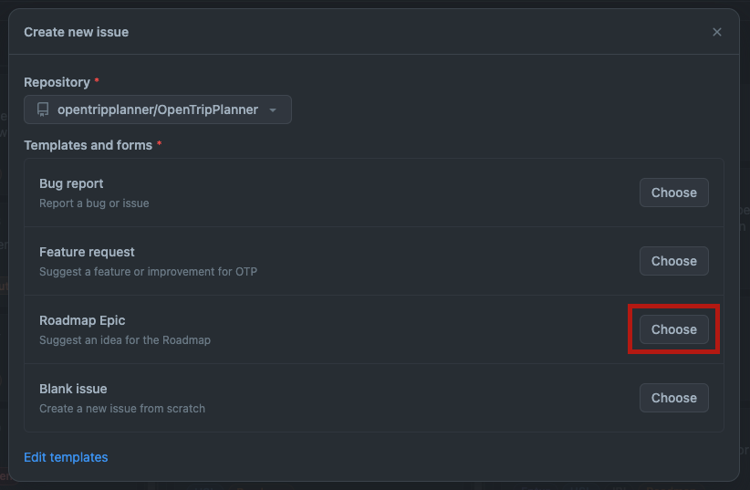

The OTP community uses a GitHub-hosted Roadmap to document all long-term feature requests for OpenTripPlanner. Unlike the typical [OTP Issues](https://github.com/opentripplanner/OpenTripPlanner/issues), the issues presented in the Roadmap outline the quarterly/yearly product-focused goals that the community intends to propose for OTP, as opposed to addressing short-term bugs or feature requests.

Any individual or organization can create an Issue on the OTP Roadmap using the following steps:

1. Navigate to the [OpenTripPlanner GitHub](https://github.com/opentripplanner/OpenTripPlanner).
2. Select the "Projects" tab.
 

3. Select the "Roadmap" project.

 
4. To add an issue, click the `Add item` under the `Wish list` column.
 

5. Click the `+` icon, and then `Create new issue`.
 

6. Pick the `Roadmap Epic` type by clicking `Choose`.
 

7. Fill in the necessary fields, and then click `Create`.
 

<be>

A roadmap issue should follow these principles:

Encourage discussions in the thread, [Gitter](https://app.gitter.im/#/room/#opentripplanner_OpenTripPlanner:gitter.im), PO- or developer meetings. Discussions should be concluded, and the roadmap description should be updated accordingly.
 - The description must be easy to understand and always updated to the latest conclusion. Click the “Edit” button. 
 - Description should at least consist of 
   - What’s the problem we want to solve
   - Why we want to, or the effect it makes
   - Linked issues
 - Description could include a solution
 - Use LABELS
Twice a year, POs and developers will sort, time frame, and clean up the issues.

